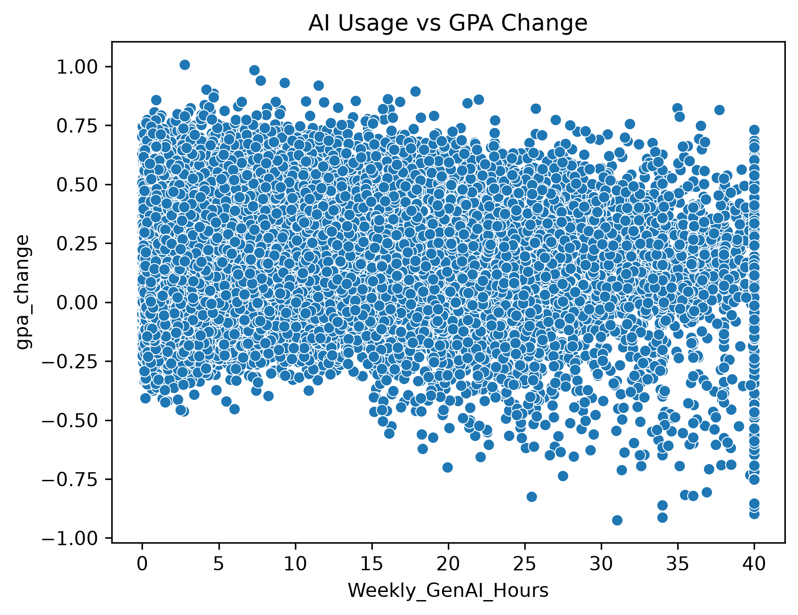
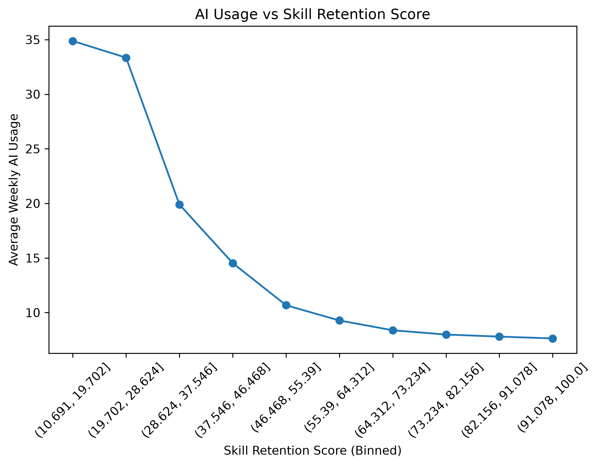
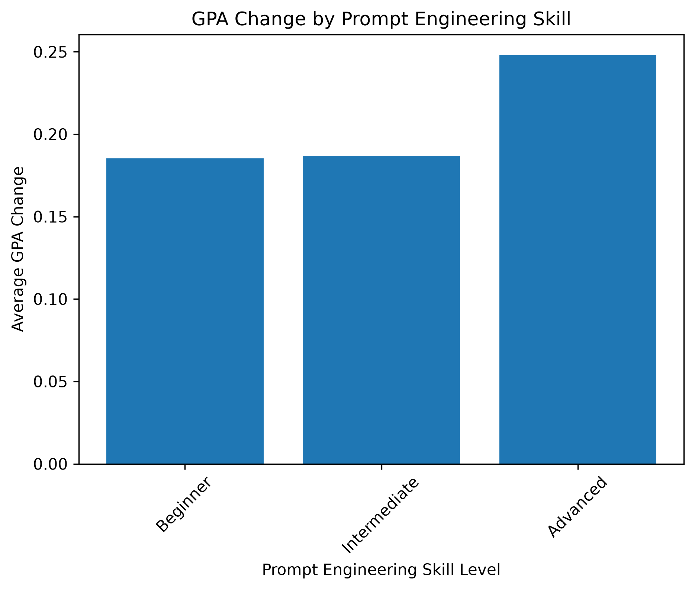
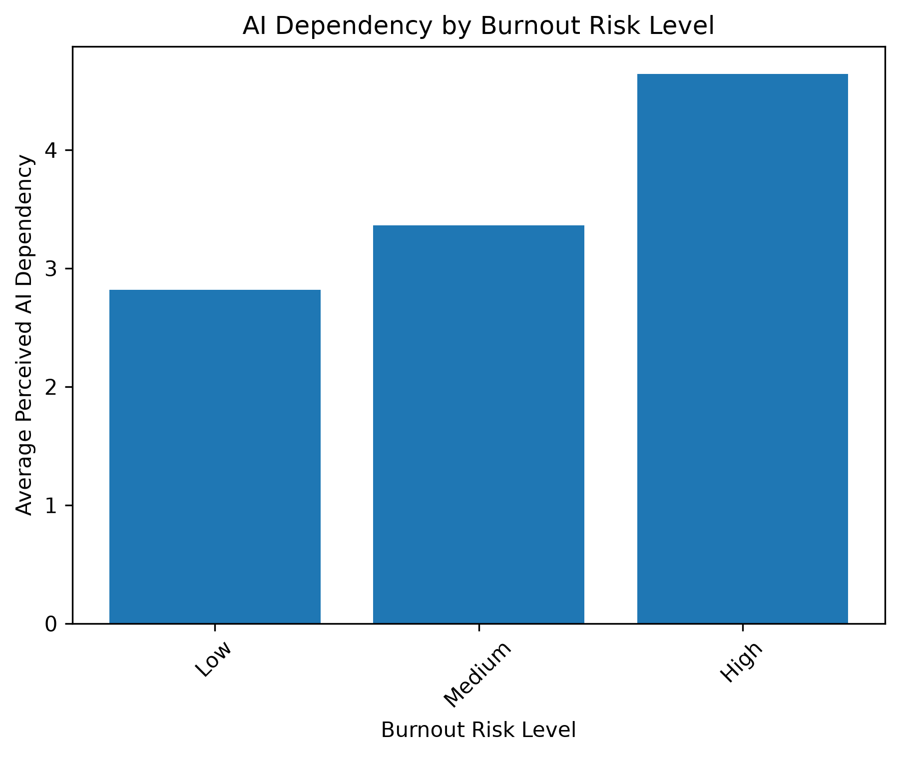
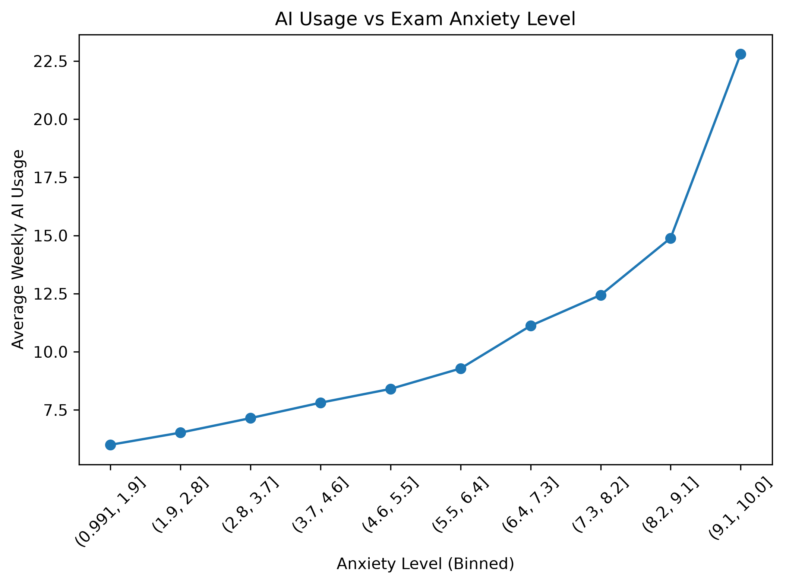
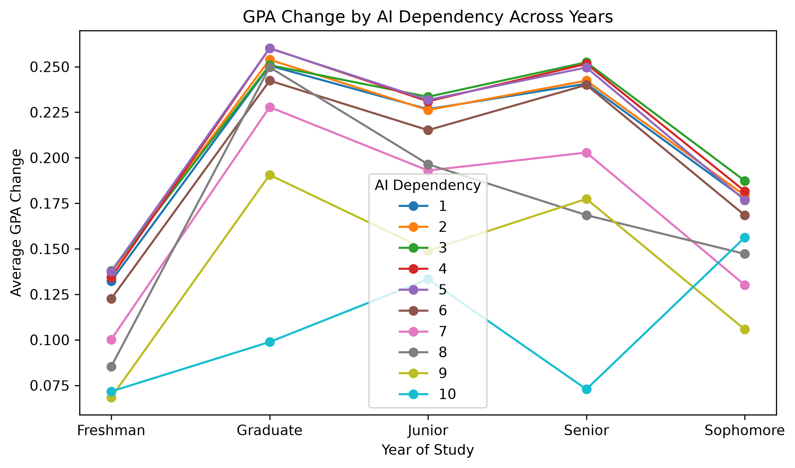

# Behavioral Analysis of Generative AI Usage on Student Performance

## Overview

This project analyzes how Generative AI usage influences academic performance, learning retention, and student well-being using a dataset of 50,000 student records.

The goal is to understand whether AI tools improve learning outcomes and how usage patterns relate to GPA change, skill retention, and behavioral indicators such as anxiety and burnout.

---

## Key Research Questions

- Does Generative AI usage improve GPA?
- Is there an optimal range of AI usage for academic performance?
- How does AI usage affect skill retention?
- Does AI dependency relate to burnout and anxiety?
- Does prompt engineering skill influence academic outcomes?

---

# Key Visualizations & Insights

---

## 1. AI Usage vs GPA Change

Moderate AI usage is associated with the highest GPA improvement, while excessive usage shows diminishing returns.

---

## 2. AI Usage vs Skill Retention

Skill retention shows a weak relationship with AI usage, suggesting that usage alone does not strongly determine learning retention.

---

## 3. Prompt Engineering Skill vs GPA

Students with stronger prompt engineering skills tend to achieve higher GPA improvements, indicating that skill in using AI matters more than usage volume.

---

## 4. Burnout Risk vs AI Dependency

Higher burnout levels show a weak association with increased AI dependency, suggesting possible reliance on AI during academic stress.

---

## 5. Anxiety vs AI Usage

Students with higher anxiety levels tend to use Generative AI slightly more, indicating a weak relationship between stress and AI usage.

---

## 6. Year of Study vs AI Dependency and GPA

The impact of AI dependency on GPA varies across academic years, suggesting that student experience influences how AI affects learning outcomes.

---

# Key Findings

- Moderate AI usage (8–16 hours/week) is associated with the highest GPA improvement  
- Prompt engineering skill is a strong predictor of academic success  
- AI dependency alone is not a strong predictor of GPA  
- Skill retention is only weakly affected by AI usage  
- Anxiety and burnout show weak behavioral relationships with AI usage  

---

# Conclusion

Generative AI acts as a supporting learning tool rather than a replacement for traditional studying.

The effectiveness of AI depends more on how it is used rather than how much it is used. Students with stronger prompting skills benefit more, while excessive usage shows diminishing returns.

Traditional study habits remain a strong predictor of academic performance.